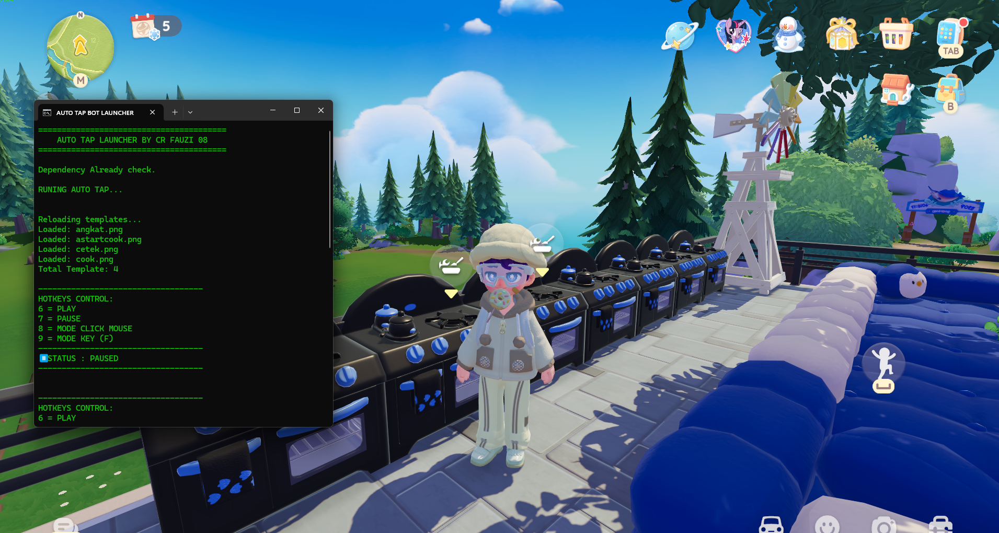

Skrip ini adalah alat otomasi berbasis Python yang dirancang khusus untuk mempermudah aktivitas dalam permainan *Heartopia*. Fokus utamanya adalah mendeteksi objek tertentu di layar secara *real-time* dan melakukan aksi (klik mouse atau penekanan tombol keyboard) secara otomatis. Skrip ini sangat dinamis karena dilengkapi dengan fitur *Watchdog* yang memungkinkan pengguna memperbarui target (gambar template) atau mengedit logika skrip tanpa harus memberhentikan atau memuat ulang program secara manual.

**Fitur Utama:**

* **Deteksi Gambar Presisi:** Menggunakan pustaka OpenCV untuk mencocokkan template gambar di folder `templates` dengan apa yang muncul di layar.
* **Dua Mode Operasi:** Tersedia **Mode Click** (untuk otomasi klik mouse pada koordinat objek) dan **Mode Key** (untuk menekan tombol keyboard tertentu seperti 'F' saat objek terdeteksi).
* **Anti Miss-Klik:** Dilengkapi sistem verifikasi ganda yang memeriksa ulang apakah objek masih ada di layar sebelum aksi dilakukan untuk menghindari kesalahan klik pada gambar yang sudah hilang.
* **Auto-Upgrade & Watchdog:** Skrip akan otomatis memuat ulang template gambar baru atau melakukan *restart* otomatis jika ada perubahan pada file kode `.py`.
* **Hotkeys Responsif:** Kontrol penuh melalui keyboard (Start, Stop, ganti Mode) yang dirancang agar sangat reaktif.

### **Cara Kerja Skrip**

Secara teknis, skrip ini bekerja melalui alur berikut:

1. **Inisialisasi:** Skrip memindai folder `templates` dan memuat semua gambar target ke dalam memori.
2. **Pemindaian Layar (Scanning):** Saat status diatur ke **PLAY (6)**, skrip mengambil cuplikan layar (*screenshot*) secara terus-menerus dalam interval milidetik.
3. **Pencocokan Template (Matching):** Setiap gambar di folder `templates` dibandingkan dengan cuplikan layar menggunakan metode `matchTemplate` dari OpenCV.
4. **Verifikasi Cepat:** Jika ditemukan kecocokan (biasanya di atas 80-85%), skrip akan melakukan verifikasi cepat pada area koordinat tersebut untuk memastikan data visual tersebut valid dan bukan gangguan *frame*.
5. **Eksekusi Aksi:**
    * Dalam **Mode Click**, kursor akan langsung berpindah dan melakukan klik pada titik tengah objek.
    * Dalam **Mode Key**, skrip akan mengirimkan perintah tekan tombol (contohnya 'F') sesuai jumlah yang diatur.
6. **Monitoring Real-time:** Secara bersamaan, thread *Watchdog* memantau folder. Jika Anda menambah gambar baru ke folder `templates`, skrip akan langsung mengenalinya tanpa gangguan pada proses yang sedang berjalan.

### **created by youtube CR FAUZI 08 powered by Ai**
